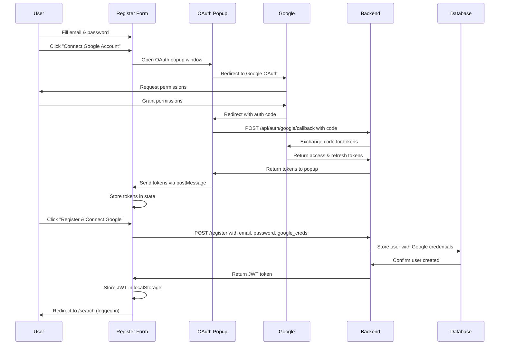
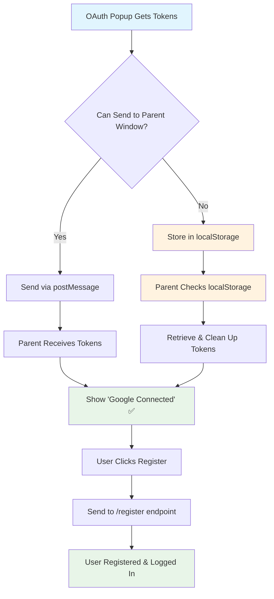

```mermaid
sequenceDiagram
    participant U as User
    participant R as Register Form
    participant P as OAuth Popup
    participant G as Google
    participant B as Backend
    participant DB as Database

    U->>R: Fill email & password
    U->>R: Click "Connect Google Account"
    R->>P: Open OAuth popup window
    P->>G: Redirect to Google OAuth
    G->>U: Request permissions
    U->>G: Grant permissions
    G->>P: Redirect with auth code
    P->>B: POST /api/auth/google/callback with code
    B->>G: Exchange code for tokens
    G->>B: Return access & refresh tokens
    B->>P: Return tokens to popup
    P->>R: Send tokens via postMessage
    R->>R: Store tokens in state
    U->>R: Click "Register & Connect Google"
    R->>B: POST /register with email, password, google_creds
    B->>DB: Store user with Google credentials
    DB->>B: Confirm user created
    B->>R: Return JWT token
    R->>R: Store JWT in localStorage
    R->>U: Redirect to /search (logged in)
```

```mermaid
graph TD
    A["OAuth Popup Gets Tokens"] --> B{"Can Send to Parent Window?"}
    B -->|Yes| C["Send via postMessage"]
    B -->|No| D["Store in localStorage"]
    C --> E["Parent Receives Tokens"]
    D --> F["Parent Checks localStorage"]
    F --> G["Retrieve & Clean Up Tokens"]
    E --> H["Show 'Google Connected' ✅"]
    G --> H
    H --> I["User Clicks Register"]
    I --> J["Send to /register endpoint"]
    J --> K["User Registered & Logged In"]
    
    style A fill:#e1f5fe
    style D fill:#fff3e0
    style F fill:#fff3e0
    style H fill:#e8f5e8
    style K fill:#e8f5e8
```